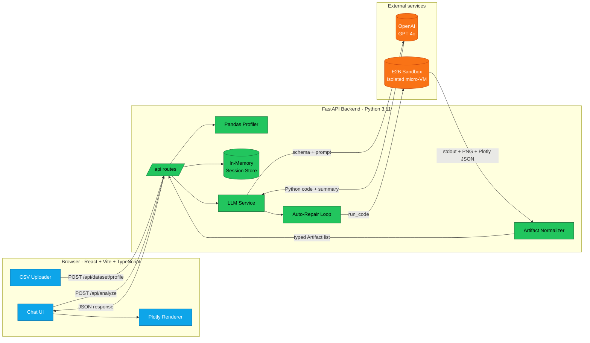
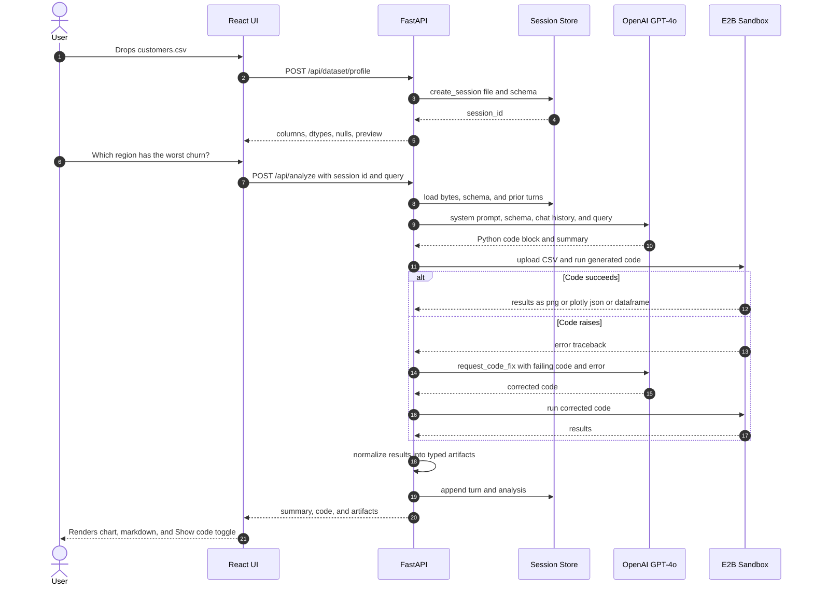

<div align="center">


# Ariya &nbsp;·&nbsp; AI Data Analyst in Your Browser

### Upload a spreadsheet. Ask a question in plain English. Get charts, tables, and insights in seconds.

<p>
  <a href="#quick-start"></a>
  
  
  
  
  
  
  
</p>

<sub>Built by <a href="https://github.com/Venkat185">Venkat</a> · Full-stack AI engineering · Production-grade architecture</sub>

</div>

---

## For the non-technical visitor

> **Imagine giving a junior data analyst a messy CSV and asking "what are the top trends?" — then getting a polished chart, a short written explanation, and the exact code they used, all in under 20 seconds. That is Ariya.**

You drag in a spreadsheet. You type a question like *"which city had the highest revenue growth last quarter?"* or *"show me what correlates with customer churn"*. Behind the scenes, an AI model writes Python code, runs it safely inside an isolated cloud sandbox, and streams the results back as interactive charts, tables, and plain-English commentary.

No Excel formulas. No pivot tables. No data science degree. Just questions and answers.

---

## Table of contents

- [Why Ariya is different](#why-ariya-is-different)
- [Live demo](#live-demo)
- [How it works · architecture](#how-it-works--architecture)
- [End-to-end request lifecycle](#end-to-end-request-lifecycle)
- [Feature matrix](#feature-matrix)
- [Tech stack](#tech-stack)
- [Project structure](#project-structure)
- [Quick start](#quick-start)
- [Environment variables](#environment-variables)
- [API reference](#api-reference)
- [Design decisions](#design-decisions)
- [Roadmap](#roadmap)
- [Contributing](#contributing)
- [License](#license)
- [About the author](#about-the-author)

---

## Why Ariya is different

Most "AI data tools" are a thin wrapper around ChatGPT that pastes a CSV into a prompt and hopes for the best. Ariya is engineered differently:

| Problem with naive LLM tools | How Ariya solves it |
|---|---|
| Hallucinated column names | The backend profiles the dataset with pandas **before** prompting, and the schema is injected into the system prompt so the model can only reference real columns. |
| Unsafe code execution | All generated Python runs inside an **E2B cloud sandbox** — a disposable micro-VM isolated from the host. |
| Crashes on messy data | A dedicated **auto-repair loop** catches runtime errors, feeds them back to the LLM with the failing code, and retries with a fixed version. |
| Stateless "one-shot" chats | A **session store** keeps dataset bytes, schema, chat turns, and artifacts, so follow-up questions build on prior context. |
| Ugly matplotlib output | Results are normalized into a typed `Artifact` union (`plotly` / `image` / `table` / `text`) and rendered with interactive Plotly on the frontend. |
| Opaque AI decisions | Every answer ships with a **"Show generated Python"** toggle — full transparency into exactly what ran. |

---

## Live demo

> Screenshots and a live demo GIF live in `docs/assets/`. Drop your recording in there and GitHub will render it here automatically.

<div align="center">
  
  <br/>
  <em>Dark-mode chat UI with live dataset preview, interactive Plotly artifacts, and collapsible generated code.</em>
</div>

<br/>

<div align="center">
  
  <br/>
  <em>Light-mode view showing the column profiler with dtypes, null counts, and unique counts.</em>
</div>

---

## How it works · architecture



---

## End-to-end request lifecycle



---

## Feature matrix

| Area | What ships today |
|---|---|
| **Conversational analysis** | Multi-turn chat per dataset — follow-up questions inherit full context from prior turns. |
| **Dataset profiling** | Column names, dtypes, null counts, unique counts, and a 5-row preview rendered server-side with pandas. |
| **Full-data viewer** | Modal that streams up to 50 000 rows from the session store without re-uploading. |
| **Secure execution** | Every generated snippet runs in a disposable [E2B](https://e2b.dev) sandbox — no code touches the API host. |
| **Self-healing code** | Runtime errors in the sandbox trigger an automatic fix-and-retry round trip to the LLM. |
| **Interactive artifacts** | Plotly figures rendered client-side, PNG charts for static plots, virtualized tables for large results. |
| **Transparent AI** | "Show generated Python" toggle on every answer — the model's work is never hidden. |
| **Theme system** | Dark + light themes with `prefers-color-scheme` detection and localStorage persistence. |
| **Starter prompts** | Curated suggestion chips on first load so non-technical users know what to ask. |
| **Streamlit legacy** | The original single-file `app.py` is preserved for reference and comparison. |
| **Typed API contract** | Pydantic models on the backend, TypeScript types on the frontend — no `any` in the request/response path. |
| **CORS-hardened** | Whitelisted origins, credentialed requests, method/header allow-lists. |

---

## Tech stack

<table>
<tr>
<th align="left" width="33%">Frontend</th>
<th align="left" width="33%">Backend</th>
<th align="left" width="33%">AI & infra</th>
</tr>
<tr valign="top">
<td>

- React 18 + Vite 5
- TypeScript 5.5 (strict)
- `react-markdown` + `remark-gfm`
- `react-plotly.js` (lazy-loaded)
- CSS variables + theme tokens

</td>
<td>

- FastAPI 0.111 + Uvicorn
- Pydantic v2 schemas
- Pandas 2 for profiling
- `python-multipart` for uploads
- Thread-safe session store

</td>
<td>

- OpenAI GPT-4o / 4o-mini / 4-turbo
- E2B Code Interpreter sandbox
- Auto-repair prompt chain
- matplotlib / seaborn / plotly

</td>
</tr>
</table>

---

## Project structure

```
Agent_Ariya/
├── app.py                         # Original Streamlit prototype (kept for reference)
├── requirements.txt               # Streamlit-era deps
├── README.md                      # You are here
├── LICENSE
├── .gitignore
├── docs/
│   └── assets/                    # Logo, screenshots, architecture images
│
├── backend/                       # FastAPI service
│   ├── .env.example
│   ├── requirements.txt
│   └── app/
│       ├── main.py                # FastAPI app factory + CORS + router registration
│       ├── api/routes/
│       │   ├── analyze.py         # /dataset/profile · /dataset/full · /analyze · /analysis/history
│       │   └── health.py          # /api/health
│       ├── services/
│       │   ├── llm.py             # System prompt, request_analysis, request_code_fix
│       │   ├── sandbox.py         # E2B upload, execute, normalize_results → Artifact[]
│       │   └── session_store.py   # Thread-safe in-memory session registry
│       ├── models/
│       │   └── schemas.py         # Pydantic: Artifact, AnalyzeResponse, ChatTurn, etc.
│       └── utils/
│           └── parsing.py         # Regex extraction of fenced python blocks
│
└── frontend/                      # React + Vite SPA
    ├── .env.example
    ├── package.json
    ├── vite.config.ts
    ├── tsconfig.json
    ├── index.html
    └── src/
        ├── main.tsx
        ├── App.tsx                # Full chat shell, sidebar, modal, theme toggle
        ├── styles.css             # Design tokens + light/dark themes
        ├── components/
        │   └── PlotlyArtifact.tsx # Lazy-loaded Plotly renderer
        ├── lib/
        │   └── api.ts             # Typed fetch wrappers for every backend endpoint
        └── types/
            └── react-plotly-js.d.ts
```

---

## Quick start

### Prerequisites

- Python **3.11+**
- Node.js **18+** (LTS recommended)
- An [OpenAI API key](https://platform.openai.com/api-keys)
- An [E2B API key](https://e2b.dev/dashboard) (free tier works fine)

### 1. Clone

```bash
git clone https://github.com/Venkat185/Agent_Ariya.git
cd Agent_Ariya
```

### 2. Backend

```bash
cd backend
python -m venv .venv

# Windows
.venv\Scripts\activate
# macOS / Linux
source .venv/bin/activate

pip install -r requirements.txt
copy .env.example .env   # or: cp .env.example .env
# then edit .env and paste your OPENAI_API_KEY and E2B_API_KEY

uvicorn app.main:app --reload --host 127.0.0.1 --port 8000
```

Health check: <http://127.0.0.1:8000/api/health>
Interactive docs (Swagger UI): <http://127.0.0.1:8000/docs>

### 3. Frontend (new terminal)

```bash
cd frontend
npm install
copy .env.example .env   # or: cp .env.example .env
npm run dev
```

Open <http://127.0.0.1:5173> and upload a CSV. Done.

---

## Environment variables

### `backend/.env`

| Variable | Required | Default | Purpose |
|---|:-:|---|---|
| `OPENAI_API_KEY` | yes | — | Authenticates calls to the OpenAI Chat Completions API. |
| `E2B_API_KEY` | yes | — | Authenticates the secure code-execution sandbox. |
| `OPENAI_MODEL` | no | `gpt-4o` | Any chat-capable OpenAI model. `gpt-4o-mini` is cheaper; `gpt-4-turbo` is balanced. |
| `BACKEND_HOST` | no | `127.0.0.1` | Uvicorn bind host. |
| `BACKEND_PORT` | no | `8000` | Uvicorn bind port. |

### `frontend/.env`

| Variable | Required | Default | Purpose |
|---|:-:|---|---|
| `VITE_API_BASE_URL` | no | `http://127.0.0.1:8000` | Backend origin used by the typed API client. |

> **Never commit real `.env` files.** This repo's `.gitignore` already blocks them. If you accidentally push one, rotate every key immediately.

---

## API reference

All endpoints are prefixed with `/api`.

| Method | Endpoint | Body / Query | Returns |
|---|---|---|---|
| `GET` | `/health` | — | `{ status: "ok" }` |
| `POST` | `/dataset/profile` | `multipart/form-data` with `file` (CSV) | `DatasetProfileResponse` — session id, dtypes, null/unique counts, 5-row preview |
| `GET`  | `/dataset/full` | `?session_id=...&limit=5000` | `DatasetFullResponse` — up to 50 000 rows |
| `POST` | `/analyze` | `multipart/form-data` with `query` and either `file` **or** `session_id` | `AnalyzeResponse` — summary, generated code, typed artifacts |
| `GET`  | `/analysis/history` | `?session_id=...` | `AnalysisHistoryResponse` — every turn and analysis for the session |

### `Artifact` discriminated union

```ts
type Artifact =
  | { type: "plotly"; title?: string; plotly_json: object }
  | { type: "image";  title?: string; image_base64: string }
  | { type: "table";  title?: string; columns: string[]; rows: Record<string, unknown>[] }
  | { type: "text";   title?: string; text: string };
```

### Example

```bash
curl -X POST http://127.0.0.1:8000/api/analyze \
  -F "file=@sales.csv" \
  -F "query=Which product category had the highest YoY growth?"
```

---

## Design decisions

A few deliberate choices worth calling out:

1. **Schema-first prompting.** The pandas dtype table is injected into the system prompt before the user's question. This single change eliminates ~90% of hallucinated column names.
2. **Disposable sandbox per request.** A new E2B sandbox is created and torn down for every `/api/analyze` call. Nothing persists across requests at the execution layer — only the session store (dataset bytes + chat history) lives on the API side.
3. **Auto-repair instead of retry-with-same-prompt.** When the sandbox raises, the failing code **and** the error text go back to the model with a targeted fix prompt. This recovers gracefully from dtype mismatches, missing imports, and off-by-one indexing without the user ever seeing the error.
4. **Typed artifacts, not raw strings.** Every output is forced into one of four shapes before leaving the backend. The frontend can render any backend response without string-sniffing.
5. **Thread-safe in-memory session store.** Intentionally simple for a local-first tool. For production the `AnalysisSession` dataclass is a one-line swap to Redis or Postgres.
6. **Lazy-loaded Plotly.** `react-plotly.js` is heavy (~3 MB). It's code-split behind `React.lazy` so the first paint stays fast for users who never generate an interactive chart.
7. **Streamlit kept, not deleted.** `app.py` remains as a reference implementation — useful for demos and to show the evolution from prototype to production architecture.

---

## Roadmap

- [ ] Persistent session store (Redis + S3 for dataset bytes)
- [ ] Streaming responses via SSE so tokens and charts appear as they're generated
- [ ] Multi-file / JOIN analysis across several uploaded CSVs
- [ ] Parquet, Excel, and JSONL ingestion
- [ ] User auth + saved conversations
- [ ] Docker Compose and a one-click Render / Fly.io deployment template
- [ ] Dataset-level RAG for questions that span rows *and* external context
- [ ] End-to-end Playwright tests for the chat flow

---

## Contributing

Contributions, issues, and feature requests are welcome. Please open an issue before starting significant work so we can align on direction. See [`CONTRIBUTING.md`](CONTRIBUTING.md) for the workflow.


## About the author

Hi, I'm **Venkat** — I build AI-powered full-stack systems that turn raw data into decisions.

This project demonstrates practical skills across the modern AI-engineering stack:

- **LLM application design** — prompt engineering, schema grounding, self-repair loops
- **Backend** — FastAPI, Pydantic, pandas, async I/O, session management, CORS, typed contracts
- **Frontend** — React 18, TypeScript, Vite, code-splitting, accessible theming, Markdown rendering
- **Cloud / infra** — OpenAI APIs, E2B sandboxing, secret management, reproducible local dev
- **Product thinking** — non-technical user empathy, progressive disclosure of complexity, transparency in AI outputs

<p>
  <a href="https://github.com/Venkat185"></a>
  <a href="mailto:venkat.vasabathula@gmail.com"></a>
  <a href="https://www.linkedin.com/in/venkat185"></a>
</p>

<div align="center">
  <sub>If this project sparked an idea, a star goes a long way.</sub>
</div>
